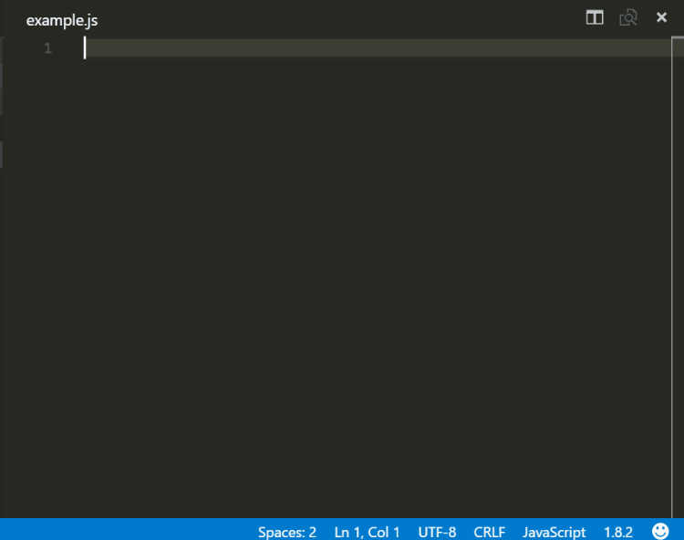

# Reactjs
## VS Code Reactjs snippets
-------------------

[](https://marketplace.visualstudio.com/items?itemName=xabikos.ReactSnippets)
[](https://marketplace.visualstudio.com/items?itemName=xabikos.ReactSnippets)
[](https://marketplace.visualstudio.com/items?itemName=xabikos.ReactSnippets)

This extension contains code snippets for [Reactjs][react] and is based on the awesome [babel-sublime-snippets][babelsublime] package.

## Installation

In order to install an extension you need to launch the Command Pallete (Ctrl + Shift + P or Cmd + Shift + P) and type Extensions.
There you have either the option to show the already installed snippets or install new ones.

## Supported languages (file extensions)
* JavaScript (.js)
* TypeScript (.ts)
* JavaScript React (.jsx)
* TypeScript React (.tsx)

## Breaking change in version 2.0.0
Removed support for jsx language as it was giving errors in developer tools [#39](https://github.com/xabikos/vscode-react/issues/39)

## Breaking change in version 1.0.0
Up until verion 1.0.0 all the [JavaScript snippets][javacript] where part of the extension. In order to avoid duplication
the snippets are now included only to this extension and if you want to use them you have to install it explicitly.

## Usage
When installing the extension React development could be really fun


As VS Code from version 0.10.10 supports React components syntax inside js files the snippets are available for JavaScript language as well.
In the following example you can see the usage of a React stateless component with prop types snippets inside a js and not jsx file.



## Snippets

Below is a list of all available snippets and the triggers of each one. The **⇥** means the `TAB` key.

| Trigger  | Content |
| -------: | ------- |
| `rcc→`   | class component skeleton |
| `rrc→`   | class component skeleton with react-redux connect |
| `rccp→`  | class component skeleton with prop types after the class |
| `rcjc→`  | class component skeleton without import and default export lines |
| `rcfc→`  | class component skeleton that contains all the lifecycle methods |
| `rwwd→`  | class component without import statements |
| `rpc→`   | class pure component skeleton with prop types after the class |
| `rsc→`   | stateless component skeleton |
| `rscp→`  | stateless component with prop types skeleton |
| `rsf→`   | stateless named function skeleton |
| `rsfp→`  | stateless named function with prop types skeleton |
| `rpt→`   | empty propTypes declaration |
| `rdp→`   | empty defaultProps declaration |
| `con→`   | class default constructor with props|
| `conc→`  | class default constructor with props and context |
| `est→`   | empty state object |
| `cwm→`   | `componentWillMount method` |
| `cdm→`   | `componentDidMount method` |
| `cwr→`   | `componentWillReceiveProps method` |
| `scu→`   | `shouldComponentUpdate method` |
| `cwup→`  | `componentWillUpdate method` |
| `cdup→`  | `componentDidUpdate method` |
| `cwun→`  | `componentWillUnmount method` |
| `gsbu→`  | `getSnapshotBeforeUpdate method` |
| `gdsfp→` | `static getDerivedStateFromProps method` |
| `cdc→`   | `componentDidCatch method` |
| `ren→`   | `render method` |
| `sst→`   | `this.setState with object as parameter` |
| `ssf→`   | `this.setState with function as parameter` |
| `props→` | `this.props` |
| `state→` | `this.state` |
| `bnd→`   | `binds the this of method inside the constructor` |

The following table lists all the snippets that can be used for prop types.
Every snippet regarding prop types begins with ```pt``` so it's easy to group it all together and explore all the available options.
On top of that each prop type snippets has one equivalent when we need to declare that this property is also required.
For example ```pta``` creates the ```PropTypes.array``` and ```ptar``` creates the ```PropTypes.array.isRequired```

| Trigger  | Content |
| -------: | ------- |
| `pta→`   | `PropTypes.array,` |
| `ptar→`  | `PropTypes.array.isRequired,` |
| `ptb→`   | `PropTypes.bool,` |
| `ptbr→`  | `PropTypes.bool.isRequired,` |
| `ptf→`   | `PropTypes.func,` |
| `ptfr→`  | `PropTypes.func.isRequired,` |
| `ptn→`   | `PropTypes.number,` |
| `ptnr→`  | `PropTypes.number.isRequired,` |
| `pto→`   | `PropTypes.object,` |
| `ptor→`  | `PropTypes.object.isRequired,` |
| `pts→`   | `PropTypes.string,` |
| `ptsr→`  | `PropTypes.string.isRequired,` |
| `ptnd→`  | `PropTypes.node,` |
| `ptndr→` | `PropTypes.node.isRequired,` |
| `ptel→`  | `PropTypes.element,` |
| `ptelr→` | `PropTypes.element.isRequired,` |
| `pti→`   | `PropTypes.instanceOf(ClassName),` |
| `ptir→`  | `PropTypes.instanceOf(ClassName).isRequired,` |
| `pte→`   | `PropTypes.oneOf(['News', 'Photos']),` |
| `pter→`  | `PropTypes.oneOf(['News', 'Photos']).isRequired,` |
| `ptet→`  | `PropTypes.oneOfType([PropTypes.string, PropTypes.number]),` |
| `ptetr→` | `PropTypes.oneOfType([PropTypes.string, PropTypes.number]).isRequired,` |
| `ptao→`  | `PropTypes.arrayOf(PropTypes.number),` |
| `ptaor→` | `PropTypes.arrayOf(PropTypes.number).isRequired,` |
| `ptoo→`  | `PropTypes.objectOf(PropTypes.number),` |
| `ptoor→` | `PropTypes.objectOf(PropTypes.number).isRequired,` |
| `ptoos→` | `PropTypes.objectOf(PropTypes.shape()),` |
| `ptoosr→`| `PropTypes.objectOf(PropTypes.shape()).isRequired,` |
| `ptsh→`  | `PropTypes.shape({color: PropTypes.string, fontSize: PropTypes.number}),` |
| `ptshr→` | `PropTypes.shape({color: PropTypes.string, fontSize: PropTypes.number}).isRequired,` |


[react]: https://facebook.github.io/react/
[babelsublime]: https://github.com/babel/babel-sublime-snippets
[javacript]: https://github.com/xabikos/vscode-javascript
